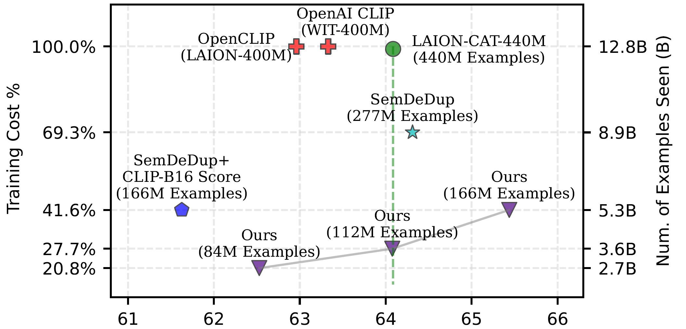
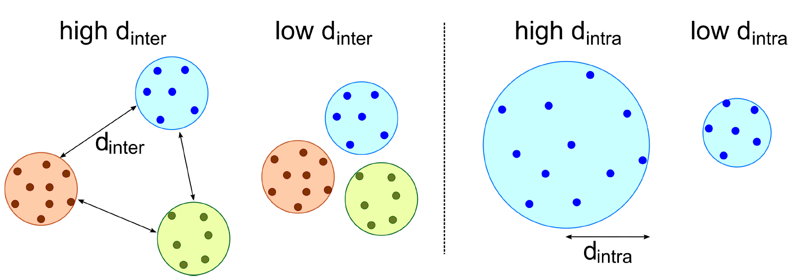

# Effective pruning of web-scale datasets based on complexity of concept clusters

This repository contains code and training logs the paper [Effective pruning of web-scale datasets based on complexity of concept clusters](https://arxiv.org/abs/2401.04578) by Amro Abbas*, Evgenia Rusak*, Kushal Tirumala, Wieland Brendel, Kamalika Chaudhuri, Ari S. Morcos.

**Abstract**: Utilizing massive web-scale datasets has led to unprecedented performance gains in machine learning models, but also imposes outlandish compute requirements for their training. In order to improve training and data efficiency, we here push the limits of pruning large-scale multimodal datasets for training CLIP-style models. Today’s most effective pruning method on ImageNet clusters data samples into separate concepts according to their embedding and prunes away the most prototypical samples. We scale this approach to LAION and improve it by noting that the pruning rate should be concept-specific and adapted to the complexity of the concept. Using a simple and intuitive complexity measure, we are able to reduce the training cost to a quarter of regular training. By filtering from the LAION dataset, we find that training on a smaller set of high-quality data can lead to higher performance with significantly lower training costs. More specifically, we are able to outperform the LAION-trained OpenCLIP-ViT-B/32 model on ImageNet zero-shot accuracy by 1.1p.p. while only using 27.7% of the data and training compute. Despite a strong reduction in training cost, we also see improvements on ImageNet dist. shifts, retrieval tasks and VTAB. On the DataComp Medium benchmark, we achieve a new state-of-the-art ImageNet zero-shot accuracy and a competitive average zero-shot accuracy on 38 evaluation tasks.



## Density-Based-Pruning: A step-by-step overview.

We list the steps necessary for Density-Based-Pruning (DBP) below. We provide details on each of the individual steps below.

- Deduplicate your dataset.
- Calculate image embeddings with a pretrainer encoder. 
- Cluster the embeddings with k-means. 
- Calculate dintra and dinter for each cluster. 
- Calculate the number of examples per cluster Nj. 

### Deduplication.

To deduplicate the dataset, we have used [SemDeDup](https://github.com/facebookresearch/SemDeDup). Please refer to their [code base](https://github.com/facebookresearch/SemDeDup) for this step. Deduplication is a crucial precursor to performing DBP, because otherwise, the clusters in the embedding space are dominated by the duplicates.

### Calculating data embeddings and k-means clustering.

We used the SemDeDup codebase also for the next two steps ("Calculate image embeddings with a pretrainer encoder" and "Cluster the embeddings with k-means"). The best encoder choice for us was the Distilled DINOV2-L/14 model and the best number of clusters was k=500 on LAION-DeDup-280M and k=100 on DataComp-Medium.

### Calculate dintra and dinter for each cluster.



Code to calculate dinter and dintra is given in Table 5 of [our paper](https://arxiv.org/abs/2401.04578) and is also provided here.

1) To calculate dintra, run:

```
python compute_avg_dist_to_cluster_centroid.py --num_clusters [NUMBER_OF_CLUSTERS] --sorted_clusters_path [PATH_TO_CLUSTERS] --avg_distance_to_cent_save_path [SAVE_FILE_PATH_DINTRA]
```

2) To calculate dinter, run:

```
python compute_centroid_distances.py --num_clusters [NUMBER_OF_CLUSTERS] --sorted_clusters_path [PATH_TO_CLUSTERS] --mean_centroid_distances_save_path [SAVE_FILE_PATH_DINTER]
```

### Calculate the number of examples per cluster Nj.

Code to calculate the number of examples per cluster Nj is given in Table 4 of [our paper](https://arxiv.org/abs/2401.04578) and is also provided here. To prune the k-means clusters using Density-Based-Pruning, run:

```bash
python prune.py \
    --num-centroids [NUMBER_OF_CLUSTERS] \
    --mean_centroid_distances_save_path [SAVE_FILE_PATH_DINTER] \
    --avg_distance_to_cent_save_path [SAVE_FILE_PATH_DINTRA] \
    --sorted-clusters-path [PATH_TO_CLUSTERS] \
    --total-dataset-size [DATASET_SIZE] \
    --prune-ratio [RATIO] \
    --save-dir [SAVE_DIR]
```

The code will create a trie file which can be used to filter a webdataset during data loading.

